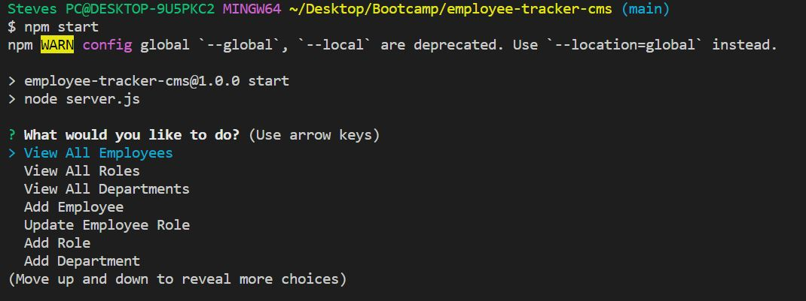
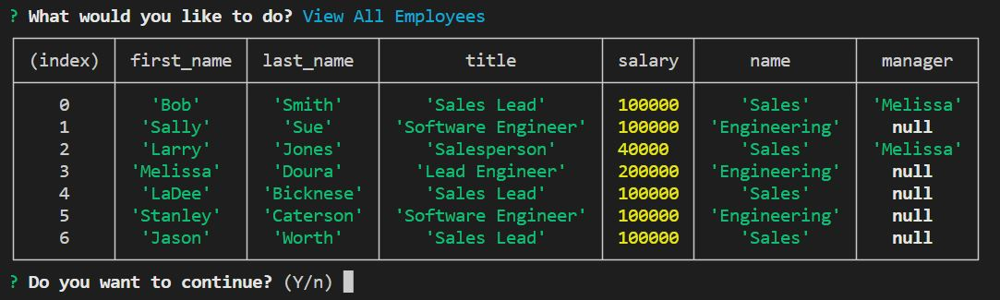
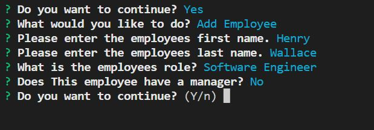

# employee-tracker-cms
## Description

This project uses inquirer prompts to build an employee database.  It allows you to add Departments, Roles and employees then view the data in tables.  I learned about MySQL and how the tables can be joined in a way to make information more accessible and useful.

## Table of Contents

- [Installation](#installation)
- [Usage](#usage)
- [License](#license)

## Installation

You will need to run npm install to download the needed packages to run this correctly.  You will also need to have MySQL downloaded and installed.  https://www.mysql.com/downloads/

## Usage

Use npm start in the command line to run the application.  Make sure you are in the parent directory for the application.

 
 

Once the application has started select the option you need and follow the prompts.

 
 

Below is a example of selecting "View All Employees"

 
 

Below is a example of selecting "Add Employee".  The prompts are a combination of user inputs and list selections.

 
 

## License

MIT License

Copyright (c) [2022] [SteveWeed79]

Permission is hereby granted, free of charge, to any person obtaining a copy
of this software and associated documentation files (the "Software"), to deal
in the Software without restriction, including without limitation the rights
to use, copy, modify, merge, publish, distribute, sublicense, and/or sell
copies of the Software, and to permit persons to whom the Software is
furnished to do so, subject to the following conditions:

The above copyright notice and this permission notice shall be included in all
copies or substantial portions of the Software.

THE SOFTWARE IS PROVIDED "AS IS", WITHOUT WARRANTY OF ANY KIND, EXPRESS OR
IMPLIED, INCLUDING BUT NOT LIMITED TO THE WARRANTIES OF MERCHANTABILITY,
FITNESS FOR A PARTICULAR PURPOSE AND NONINFRINGEMENT. IN NO EVENT SHALL THE
AUTHORS OR COPYRIGHT HOLDERS BE LIABLE FOR ANY CLAIM, DAMAGES OR OTHER
LIABILITY, WHETHER IN AN ACTION OF CONTRACT, TORT OR OTHERWISE, ARISING FROM,
OUT OF OR IN CONNECTION WITH THE SOFTWARE OR THE USE OR OTHER DEALINGS IN THE
SOFTWARE.

---